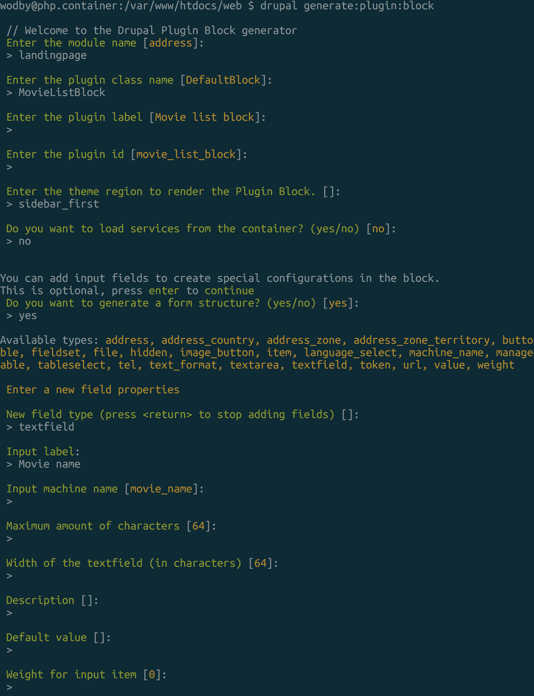
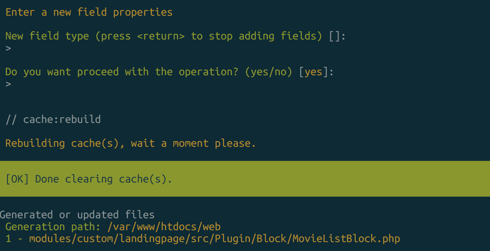
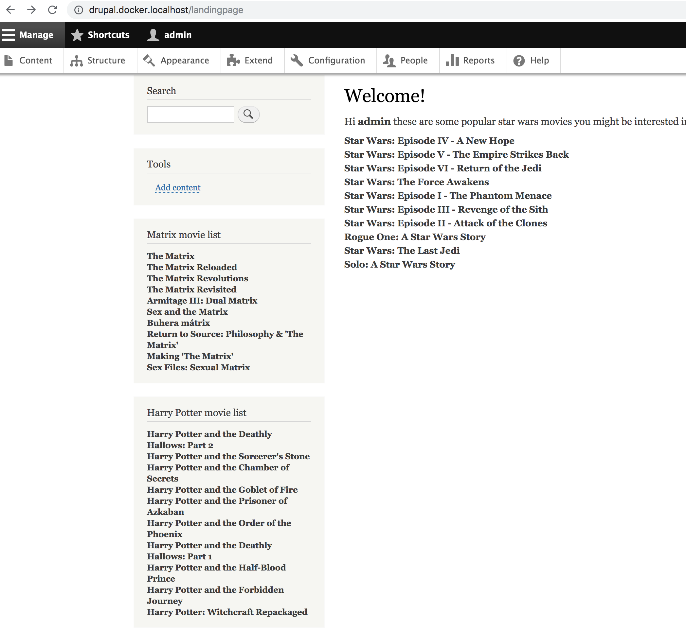

### 9 Creating a block

`drupal generate:plugin:block`

Observations:
 - A new block plugin file under Plugin/Block/MovieListBlock.php
 - You can create an instance in the block layout and choose a movie name

As final points we:
 - Abstract the templates a create a movie-list.html.twig and theme hook implementation
 - Inject the movie service in to the newly created block
 - Adjust the LandingpageController to use the correct theme implementation

