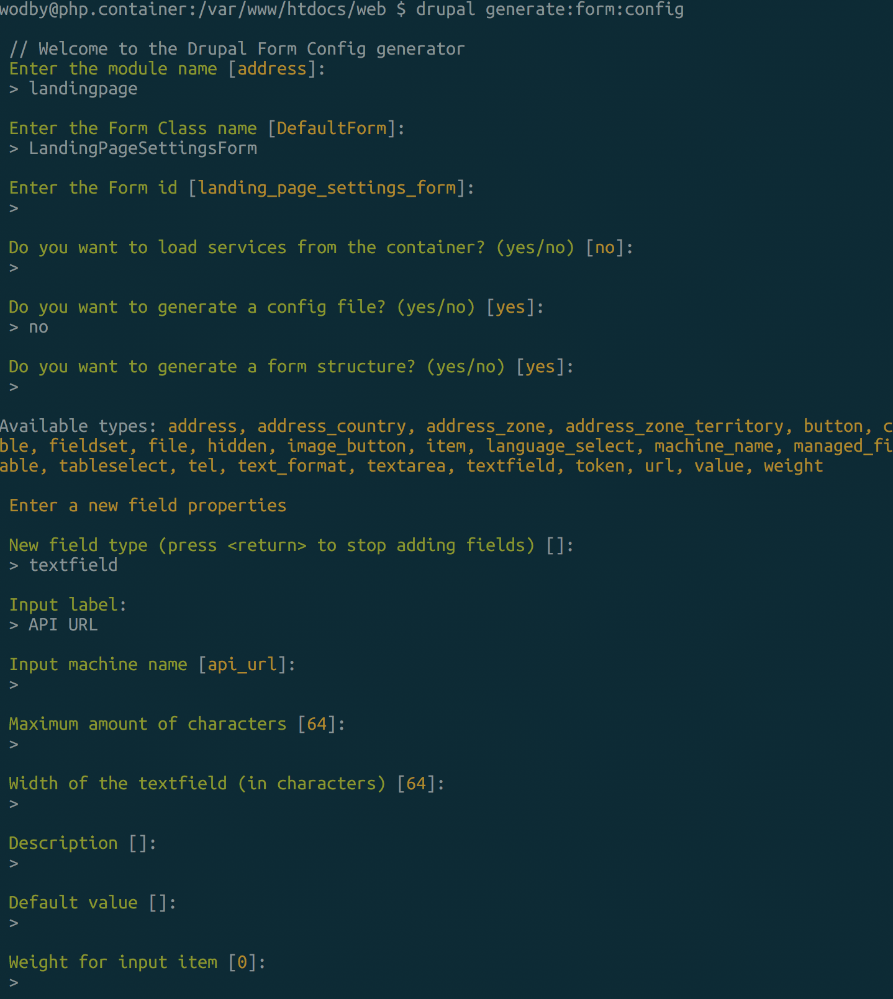
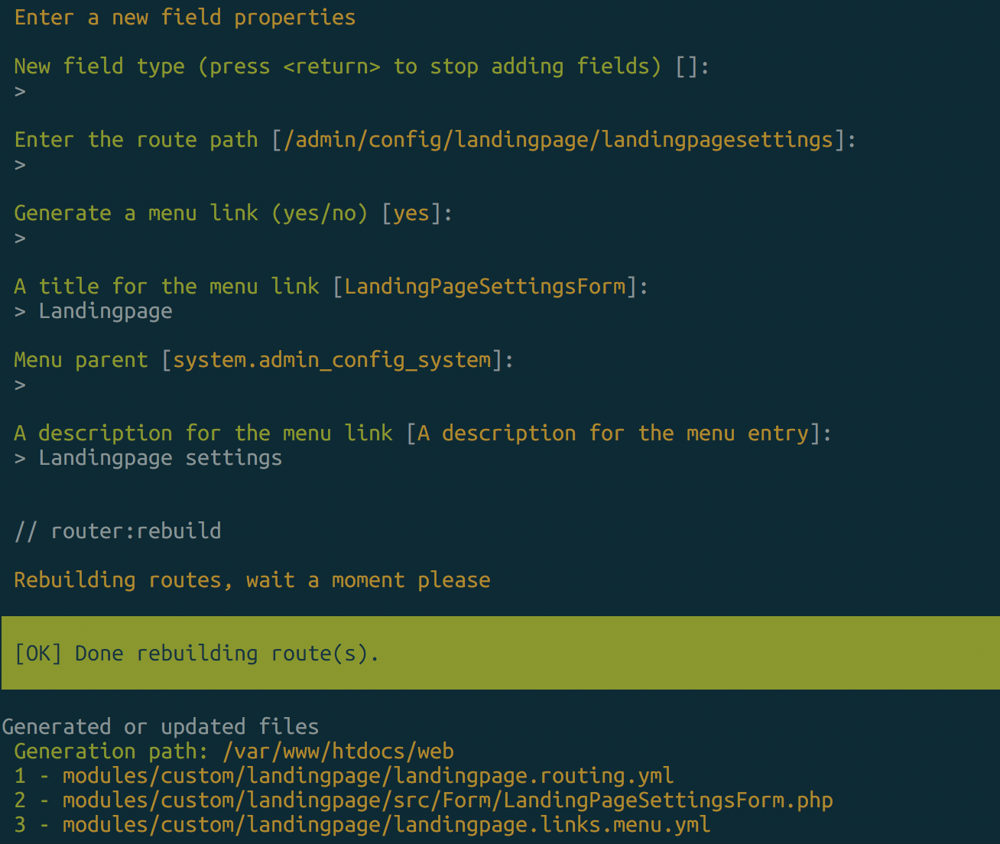

### 6.1 Using theme hook and templates

Observations:
 - A new landingpage.links.menu.yml file
 - A new folder and file under src/Form/LandingPageSettingsForm.php
 - A new entry in the routing yml file for the configuration form
 - Usage of the Form API

We adapt the landingpage controller with an additional dependency injection for reading the configuration.