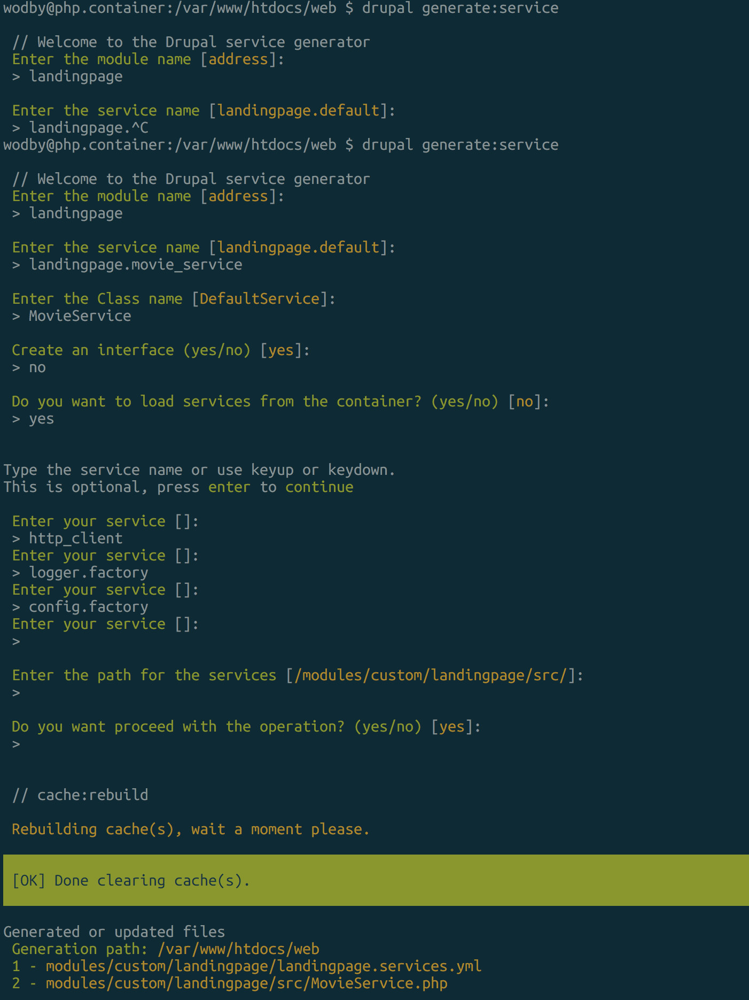

### 7 Creating a movie service

Observations:
 - Services are frequently used objects and managed by the services container.
 - A new service file src/MovieService.php
 - A new landingpage.services.yml file
 
 
We now abstract everything from the controller to our service.

We adapted the landingpage controller to use the service instead with dependency injection as well.