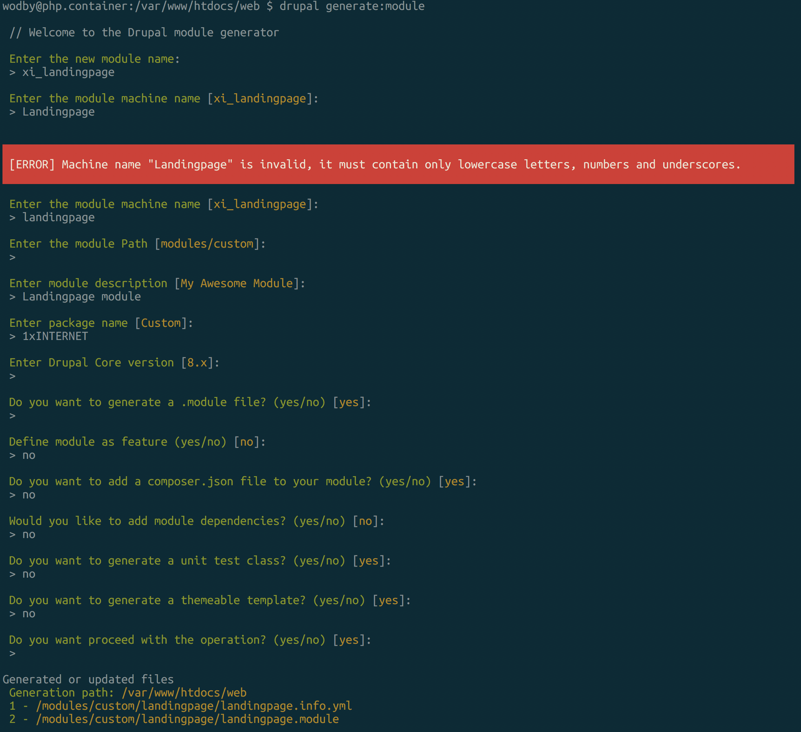

### 1.1 Generate a module with the drupal console

`drupal generate:module`

Observations:
 - folder structure (contrib/custom/files)
 - mandatory .info.yml file
 - mandatory/optional attributes in the info.yml file
 - case sensitive filenames
 - optional .module file in comparision with Drupal 7

### 1.2 Enable the module

There are two options:
 - Enable the module through the backend
 - Enable it with drush/drupal
 
`drush en -y landingpage`

 